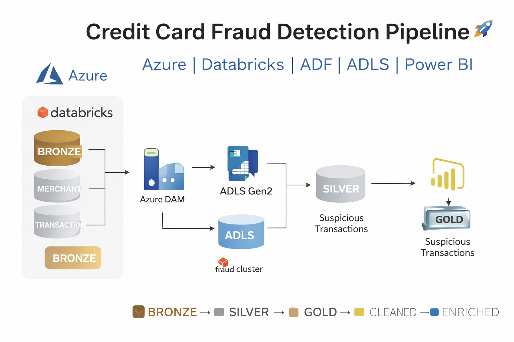
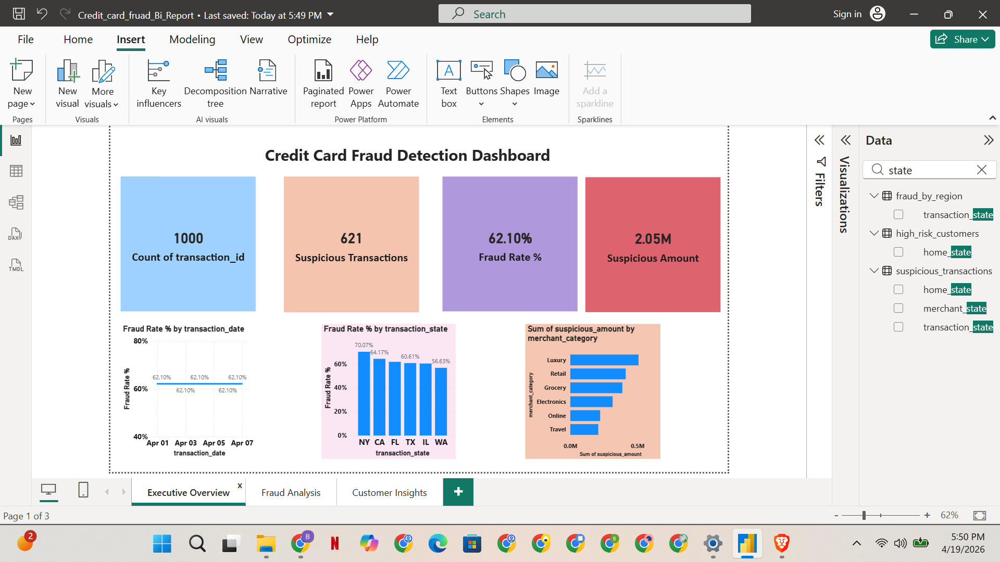

# Credit Card Fraud Detection Pipeline (Azure)


## Project Overview
This project builds an end-to-end data engineering pipeline to detect suspicious credit card transactions using Azure services.

## Architecture
Source → ADF → ADLS (Bronze) → Databricks (Silver/Gold) → SQL → Power BI

## Tools Used
- Azure Data Factory
- Azure Data Lake Storage Gen2
- Azure Databricks
- SQL
- Power BI

## Goal
Identify fraudulent transactions using rule-based detection and provide business insights.

## Project Timeline
- Day 1: Setup
- Day 2: Dataset
- Day 3: Ingestion
- Day 4: Cleaning
- Day 5: Fraud Logic
- Day 6: Gold Layer
- Day 7: SQL
- Day 8: Power BI
- Day 9: Orchestration
- Day 10: Final Polish

# Day 1 — Azure Project Setup & Architecture

## Objective

The goal of Day 1 is to set up the complete Azure environment and project structure required to build an end-to-end Credit Card Fraud Detection Data Pipeline.

## Architecture Overview

The project follows a modern data engineering architecture using Azure services:

**Source → Azure Data Factory → ADLS Gen2 (Bronze/Silver/Gold) → Azure Databricks → SQL Analytics → Power BI**


## Azure Services Created

### 1. Resource Group

* **Name:** rg-fraud-project
* Purpose: Logical container to manage all Azure resources together

---

### 2. Azure Data Lake Storage Gen2

* **Storage Account:** stfraud<yourname>
* **Feature Enabled:** Hierarchical Namespace (ADLS Gen2)

#### Containers Created:

* **bronze** → Raw data storage
* **silver** → Cleaned and transformed data
* **gold** → Business-ready aggregated data


### 3. Azure Data Factory

* **Name:** adf-fraud-project
* Purpose: Data ingestion and pipeline orchestration

### 4. Azure Databricks

* **Workspace:** dbx-fraud-project
* Purpose: Data transformation, fraud detection logic, and analytics

## Project Structure (GitHub)

```bash
credit-card-fraud-azure-project/
│
├── data/
│   ├── raw/
│   └── sample/
├── notebooks/
├── pipelines/
├── sql/
├── dashboard/
├── docs/
└── README.md
```


## Artifacts

Screenshots captured for documentation:

* Azure Resource Group
* Storage Account
* ADLS Containers (bronze, silver, gold)
* Azure Data Factory
* Azure Databricks Workspace

Stored in:

docs/screenshots/

## Key Concepts Learned

* Understanding of Azure resource organization
* Importance of ADLS Gen2 for data lake architecture
* Role of Data Factory in data ingestion
* Role of Databricks in data transformation
* Medallion architecture (Bronze → Silver → Gold)

## Cost Optimization Strategy

To ensure the project stays within budget:

* No Databricks clusters were created or run on Day 1
* No pipelines were executed
* Only essential resources were provisioned
* All services configured using basic/standard tiers

## Key Outcome

Successfully established the foundational infrastructure required to build a scalable and production-like fraud detection data pipeline on Azure.

# Day 2 — Dataset Creation for Fraud Detection

## Objective

The goal of Day 2 is to design and create realistic banking datasets that simulate credit card transactions, customers, and merchants. These datasets form the foundation for building a fraud detection pipeline.

---

## Datasets Created

Three core datasets were created:

### 1. transactions.csv (Core Dataset)

Contains transaction-level data used to detect fraudulent activity.

**Columns:**

* transaction_id
* customer_id
* merchant_id
* transaction_timestamp
* amount
* transaction_type
* merchant_category
* city
* state
* channel (POS / Online)
* card_type (Credit / Debit)

### 2. customers.csv

Contains customer profile information.

**Columns:**

* customer_id
* full_name
* age
* gender
* home_city
* home_state
* account_open_date
* customer_segment (Premium / Standard)

---

### 3. merchants.csv

Contains merchant details and risk classification.

**Columns:**

* merchant_id
* merchant_name
* merchant_category
* merchant_city
* merchant_state
* risk_level (Low / Medium / High)

## Fraud Simulation Logic

To make the dataset realistic and suitable for fraud detection, multiple fraud patterns were intentionally introduced:

### High-Value Transactions

Transactions with unusually high amounts (e.g., > $2000)

### Location Mismatch

Customer home state differs from transaction state

### Rapid Transactions

Multiple transactions within a short time window for the same customer

### High-Risk Merchant Categories

Transactions involving:

* Electronics
* Luxury
* Travel
* Online platforms

### Unusual Time Activity

Transactions occurring during late-night hours

---

## Dataset Size

| Dataset          | Records |
| ---------------- | ------- |
| customers.csv    | ~100    |
| merchants.csv    | ~30     |
| transactions.csv | ~1000   |

---

## Design Considerations

* Simulated real-world banking behavior
* Included both normal and suspicious transactions
* Balanced dataset size for performance and cost efficiency
* Designed to support downstream transformations and analytics

---

## Project Structure Update

```bash
data/
└── raw/
    ├── customers.csv
    ├── merchants.csv
    └── transactions.csv
```

---

## Artifacts

* Dataset screenshots stored in: `docs/screenshots/`
* Data dictionary created in: `docs/data_dictionary.md`

## Key Outcome

A realistic, fraud-oriented dataset is now ready for ingestion into Azure Data Lake (Bronze layer) using Azure Data Factory in the next phase.

# Day 3 — Data Ingestion using Azure Data Factory (Bronze Layer)

## Objective

The goal of Day 3 is to ingest raw CSV datasets into Azure Data Lake Storage Gen2 (Bronze layer) using Azure Data Factory pipelines.

---

## Overview

In this phase, raw datasets created on Day 2 are moved into the cloud storage layer without any transformations. This ensures data is preserved in its original format for traceability and reprocessing.

---

## ⚙️ Tools Used

* Azure Data Factory
* Azure Data Lake Storage Gen2 (ADLS Gen2)

---

## Data Sources

The following datasets were ingested:

* `customers.csv`
* `merchants.csv`
* `transactions.csv`

---

## Implementation Steps

### 1. Data Upload to ADLS (Bronze)

* Created directories in Bronze container:

  * `customers/`
  * `merchants/`
  * `transactions/`
* Uploaded CSV files into respective folders

---

### 2. Linked Service Creation

* Created connection to ADLS Gen2:

  * Name: `ls_adls_fraud`
* Used Account Key authentication

---

### 3. Dataset Creation

Created source and sink datasets for each file:

| Dataset Type | Dataset Name         |
| ------------ | -------------------- |
| Source       | ds_customers_src     |
| Sink         | ds_customers_sink    |
| Source       | ds_merchants_src     |
| Sink         | ds_merchants_sink    |
| Source       | ds_transactions_src  |
| Sink         | ds_transactions_sink |

---

### 4. Pipeline Development

Created pipelines using Copy Activity:

* `pl_ingest_customers`
* `pl_ingest_merchants`
* `pl_ingest_transactions`

Each pipeline:

* Reads data from Bronze folder
* Writes a copy within Bronze (validation step)

---

### 5. Pipeline Execution

* Pipelines executed using Debug mode
* Verified successful execution in ADF Monitor

---

## Data Flow

Local Files → ADLS Bronze → ADF Copy → Bronze (validated copy)

---

## Output Structure

```bash
bronze/
 ├── customers/customers.csv
 ├── customers/customers_copy.csv
 ├── merchants/merchants.csv
 ├── merchants/merchants_copy.csv
 ├── transactions/transactions.csv
 └── transactions/transactions_copy.csv
```

---

## Artifacts

Screenshots captured:

* ADF pipeline canvas
* Copy activity configuration
* Pipeline execution results
* Bronze storage output

Stored in:

```
docs/screenshots/
```

## Key Learnings

* Understanding of Azure Data Factory components:

  * Linked Services
  * Datasets
  * Pipelines
  * Activities
* Data ingestion patterns in cloud environments
* Importance of Bronze layer in Medallion architecture

## Challenges & Fixes

* Schema import issues resolved by setting "Import Schema" to "From connection" or "None"
* File path errors corrected by verifying directory structure
* Ensured header row was correctly detected

---

## Outcome

Successfully built ingestion pipelines to move raw data into the Bronze layer, establishing the foundation for downstream transformations.

# Day 4 — Data Transformation using Azure Databricks (Silver Layer)

## Objective

The goal of Day 4 is to clean, standardize, and transform raw data from the Bronze layer into structured and optimized datasets in the Silver layer using Azure Databricks.

---

## Overview

Raw data ingested in Day 3 is processed to improve data quality and consistency. This step ensures that datasets are ready for business logic and analytics.

---

## Tools Used

* Azure Databricks
* Apache Spark (PySpark)
* Azure Data Lake Storage Gen2

---

## Input Data (Bronze Layer)

* `customers_copy.csv`
* `merchants_copy.csv`
* `transactions_copy.csv`

---

## Transformation Steps

### 1. Data Ingestion

* Read CSV files from Bronze container using Spark

---

### 2. Data Cleaning

#### ✔ Remove Duplicates

* Eliminated duplicate records from all datasets

#### ✔ Trim Whitespace

* Removed leading and trailing spaces from string columns

---

### 3. Data Type Standardization

* Converted:

  * `amount` → Double
  * `transaction_timestamp` → Timestamp
  * `age` → Integer

---

### 4. Null Handling

* Replaced null values in key fields (e.g., amount = 0)

---

### 5. Data Standardization

* Converted state values to uppercase
* Ensured consistency across datasets

---

### 6. Data Validation

* Checked row counts before and after transformation
* Verified schema and data types

---

## Output Data (Silver Layer)

Cleaned datasets stored in Parquet format:

```bash
silver/
 ├── customers/
 ├── merchants/
 └── transactions/
```

---

## Why Parquet Format?

* Columnar storage → faster queries
* Compression → reduced storage cost
* Optimized for analytics workloads

---

## Artifacts

Captured:

* Databricks notebook transformations
* Data preview outputs
* Silver layer storage structure

 Stored in:

```
docs/screenshots/
```

---

## Key Learnings

* Data cleaning techniques in PySpark
* Importance of schema enforcement
* Benefits of columnar storage (Parquet)
* Role of Silver layer in Medallion architecture

---

## Challenges & Fixes

* Timestamp conversion issues fixed using proper casting
* Storage access resolved using account key configuration
* Path errors corrected by verifying `abfss://` format

---

##  Outcome

Successfully transformed raw Bronze data into clean, structured Silver datasets ready for fraud detection and analytics.

# Day 5 — Fraud Detection Logic & Risk Scoring (Gold Layer)

## Objective

The goal of Day 5 is to implement fraud detection logic using cleaned datasets from the Silver layer and generate a fraud-enriched dataset for analytics in the Gold layer.

---

## Overview

In this phase, transaction, customer, and merchant data are combined to identify suspicious activity using rule-based logic. A risk scoring system is applied to classify transactions into different fraud risk levels.

---

## Tools Used

* Azure Databricks
* Apache Spark (PySpark)
* Azure Data Lake Storage Gen2

---

## Input Data (Silver Layer)

* `silver/customers/`
* `silver/merchants/`
* `silver/transactions/`

---

## Implementation Steps

### 1. Data Ingestion

* Read cleaned datasets from Silver layer using Spark

---

### 2. Data Integration

* Joined:

  * Transactions
  * Customers
  * Merchants

* Enriched transaction data with:

  * Customer demographics
  * Merchant risk levels

---

### 3. Fraud Rule Engineering

The following fraud indicators were created:

#### High Transaction Amount

* Flag transactions with amount > $2000

#### Location Mismatch

* Customer home state differs from transaction state

#### High-Risk Merchant

* Merchant classified as "High" risk

#### Night-Time Activity

* Transactions between 12 AM and 5 AM

#### Rapid Repeat Transactions

* Multiple transactions by same customer within the same hour

---

## Risk Scoring Model

Each rule contributes to a weighted risk score:

| Rule               | Score |
| ------------------ | ----- |
| High Amount        | 40    |
| Location Mismatch  | 25    |
| High-Risk Merchant | 15    |
| Night Transaction  | 10    |
| Rapid Repeat       | 20    |

---

### Fraud Classification

* **High Risk** → Score ≥ 50
* **Medium Risk** → Score 25–49
* **Low Risk** → Score < 25

---

## Output Columns Created

* `is_high_amount`
* `is_location_mismatch`
* `is_high_risk_merchant`
* `is_night_transaction`
* `is_rapid_repeat`
* `risk_score`
* `fraud_flag` (Yes/No)
* `risk_level_category` (Low/Medium/High)
* `fraud_reason` (human-readable explanation)

---

## Output Data (Gold Layer)

Fraud-enriched datasets stored in:

```bash
gold/
 ├── suspicious_transactions/
 └── suspicious_transactions_only/
```

---

## Sample Use Cases

* Identify high-risk transactions
* Monitor fraud trends
* Analyze risky customers and merchants
* Support fraud investigation workflows

---

## Artifacts

Captured:

* Databricks notebook logic
* Fraud flag outputs
* Sample suspicious transactions
* Gold layer storage verification

 Stored in:

```
docs/screenshots/
```

---

## Key Learnings

* Rule-based fraud detection design
* Data enrichment through joins
* Window functions for behavioral patterns
* Risk scoring methodology
* Building analytics-ready datasets

---

## Challenges & Fixes

* Ensured correct timestamp format for time-based rules
* Verified merchant risk values for consistency
* Handled null values before applying rules
* Simplified rapid transaction logic using hourly grouping

---

## Outcome

Successfully developed a fraud detection framework that identifies suspicious transactions using rule-based scoring and prepares data for business analytics and reporting.

---

# Day 6 — Gold Layer Aggregations (Business-Ready Tables)

## Objective

The goal of Day 6 is to transform fraud-enriched data into business-level aggregation tables that support analytics, reporting, and dashboarding.

---

## Overview

After implementing fraud detection logic on Day 5, the dataset now contains risk scores and fraud flags. In this phase, we aggregate this data into meaningful business insights for decision-making and visualization.

---

## Tools Used

* Azure Databricks
* Apache Spark (PySpark)
* Azure Data Lake Storage Gen2

---

## Input Data

* `gold/suspicious_transactions/` (Fraud-enriched dataset from Day 5)

---

## Aggregation Tables Created

### 1. fraud_summary_daily

#### Business Question:

How is fraud trending over time?

**Metrics:**

* total_transactions
* suspicious_transactions
* total_amount
* suspicious_amount
* fraud_rate

---

### 2. fraud_by_region

#### Business Question:

Which regions (states) have the highest fraud activity?

**Metrics:**

* total_transactions
* suspicious_transactions
* total_amount
* fraud_rate

---

### 3. fraud_by_merchant_category

#### Business Question:

Which merchant categories are most associated with fraud?

**Metrics:**

* total_transactions
* suspicious_transactions
* suspicious_amount

---

### 4. high_risk_customers

#### Business Question:

Who are the highest-risk customers based on transaction behavior?

**Metrics:**

* suspicious_count
* suspicious_total_amount
* avg_risk_score

---

## Output Data (Gold Layer)

All aggregation tables are stored in Parquet format:

```bash
gold/
├── suspicious_transactions/
├── fraud_summary_daily/
├── fraud_by_region/
├── fraud_by_merchant_category/
└── high_risk_customers/
```

---

## Key Calculations

* **Fraud Rate** = suspicious_transactions / total_transactions
* **Suspicious Amount** = sum of transaction amounts where fraud_flag = 'Yes'
* **High-Risk Customers** = customers with highest suspicious transaction volume and amount

---

## Why These Tables Matter

These tables are designed for:

* SQL-based business analysis
* Power BI dashboards
* Fraud monitoring and reporting
* Executive-level insights

---

## Artifacts

Captured:

* Aggregation outputs from Databricks
* Gold layer storage structure
* Sample results for each table

 Stored in:

```
docs/screenshots/
```

---

## Key Learnings

* Building business-level aggregations using PySpark
* Translating raw data into actionable insights
* Designing datasets for BI tools
* Understanding fraud KPIs and metrics

---

## Challenges & Fixes

* Ensured accurate fraud rate calculations (handled division properly)
* Verified fraud_flag consistency before aggregation
* Checked grouping columns for correctness
* Handled null values in aggregation logic

---

## Outcome

Successfully created analytics-ready Gold layer datasets that power SQL queries and Power BI dashboards, enabling meaningful fraud insights.

---

# Day 7 — SQL Business Analysis (Fraud Insights)

## Objective

The goal of Day 7 is to perform business analysis on fraud data using SQL queries and extract meaningful insights from Gold layer datasets.

---

## Overview

After building the Gold layer aggregation tables, SQL is used to analyze fraud patterns, customer behavior, and financial impact. This step bridges data engineering and business analytics.

---

## Tools Used

* Azure Databricks (SQL)
* SQL (Spark SQL)
* Azure Data Lake Storage Gen2

---

## Data Sources (Gold Layer)

* `fraud_summary_daily`
* `fraud_by_region`
* `fraud_by_merchant_category`
* `high_risk_customers`
* `suspicious_transactions`

---

## Implementation Steps

### 1. Created Temporary Views

* Loaded Gold datasets into SQL views for querying

---

### 2. Developed Business Queries

The following analytical queries were implemented:

---

### Daily Fraud Trend

Analyzed how fraud activity changes over time.

**Insight:** Helps identify increasing or decreasing fraud patterns.

---

### Fraud by Region

Identified states with highest fraud rates.

**Insight:** Enables region-based fraud monitoring.

---

### Fraud by Merchant Category

Analyzed fraud across different industries.

**Insight:** Highlights high-risk merchant segments.

---

### High-Risk Customers

Identified customers with highest suspicious activity.

**Insight:** Supports fraud investigation and customer risk profiling.

---

### Total Fraud Loss

Calculated total monetary impact of fraudulent transactions.

**Insight:** Measures financial exposure due to fraud.

---

### Fraud by Hour

Analyzed fraud activity by time of day.

**Insight:** Detects peak fraud hours (e.g., night transactions).

---

### Fraud by Card Type

Compared fraud across Credit vs Debit cards.

**Insight:** Identifies risk distribution by payment type.

---

### Fraud by Channel

Compared fraud in Online vs POS transactions.

**Insight:** Highlights digital fraud trends.

---

### Average Fraud Amount

Calculated typical size of fraudulent transactions.

**Insight:** Helps understand severity of fraud events.

---

### Customer Segment Risk

Analyzed fraud by customer segment.

**Insight:** Identifies whether Premium or Standard users are more vulnerable.

---

## Project Structure Update

```bash id="1trgkm"
sql/
└── analytics/
    ├── fraud_trend.sql
    ├── fraud_by_region.sql
    ├── fraud_by_merchant_category.sql
    ├── high_risk_customers.sql
    ├── fraud_by_channel.sql
    ├── fraud_by_card_type.sql
    └── additional_analysis.sql
```

---

##  Artifacts

Captured:

* SQL query results
* Analytical outputs
* Databricks SQL notebook

 Stored in:

```id="x3e27z"
docs/screenshots/
```

---

## Key Learnings

* Writing business-focused SQL queries
* Analyzing fraud trends and patterns
* Converting data into actionable insights
* Understanding real-world fraud analytics use cases

---

## Challenges & Fixes

* Ensured correct filtering using `fraud_flag = 'Yes'`
* Verified timestamp functions (HOUR, DATE)
* Handled aggregation accuracy
* Validated data consistency before analysis

---

## Outcome

Successfully performed SQL-based analysis on fraud data, generating actionable insights that can support business decisions and fraud monitoring strategies.

---

# Day 8 — Power BI Dashboard (Fraud Analytics Visualization)

## Objective

The goal of Day 8 is to build an interactive Power BI dashboard to visualize fraud insights and enable business users to monitor suspicious transactions effectively.

---

## Overview

After preparing Gold layer datasets and SQL insights, this phase focuses on creating a user-friendly dashboard for fraud analysis. The dashboard highlights key performance indicators (KPIs), trends, and risk patterns.

---

## Tools Used

* Power BI Desktop
* Azure Databricks (data export)
* Azure Data Lake Storage Gen2

---

## Data Sources

The following datasets were used:

* `fraud_summary_daily`
* `fraud_by_region`
* `fraud_by_merchant_category`
* `high_risk_customers`
* `suspicious_transactions`

---

##  Dashboard Structure

###  Page 1 — Executive Overview

#### KPIs:

* Total Transactions
* Suspicious Transactions
* Fraud Rate (%)
* Total Fraud Amount

#### Visuals:

*  Fraud Trend Over Time (Line Chart)
*  Fraud by Region (Bar Chart)
*  Fraud by Merchant Category (Bar Chart)

## Executive Overview Dashboard


---

###  Page 2 — Fraud Analysis

#### Visuals:

*  Fraud by Hour (Column Chart)
*  Fraud by Channel (Pie Chart)
*  Fraud by Card Type (Donut Chart)

---

###  Page 3 — Customer Insights

#### Visuals:

*  Top High-Risk Customers (Table)
*  Customer Segment Risk (Bar Chart)
*  Detailed Transaction View (Table)

---

## Interactivity Features

Added slicers (filters) for:

* Date
* State
* Merchant Category
* Channel
* Risk Level

These filters enable dynamic and interactive analysis across all dashboard pages.

---

## Design Enhancements

* Dashboard title: **"Credit Card Fraud Detection Dashboard"**
* Consistent color theme:

  *  Red → Fraud
  *  Blue → Normal
* Proper alignment and spacing
* Borders and shadows for better visualization

---

## Output

Dashboard file stored in:

```bash id="jhlfql"
dashboard/fraud_dashboard.pbix
```

---

## Artifacts

Captured:

* Full dashboard screenshots
* Individual page visuals
* Key insights views

 Stored in:

```id="hvwyy2"
docs/screenshots/
```

---

## Key Insights Delivered

* Fraud trends over time
* High-risk regions
* Fraud-prone merchant categories
* Customer risk profiling
* Channel-based fraud distribution
* Transaction-level fraud details

---

## Key Learnings

* Building interactive dashboards in Power BI
* Visualizing business KPIs effectively
* Designing user-friendly analytics reports
* Connecting data engineering outputs to BI tools

---

## Challenges & Fixes

* Ensured correct data relationships between tables
* Fixed field mapping issues in visuals
* Adjusted date formats for proper trend analysis
* Verified filter interactions across visuals

---

## Outcome

Developed a professional, interactive fraud analytics dashboard that enables stakeholders to monitor fraud patterns and make data-driven decisions.

---


